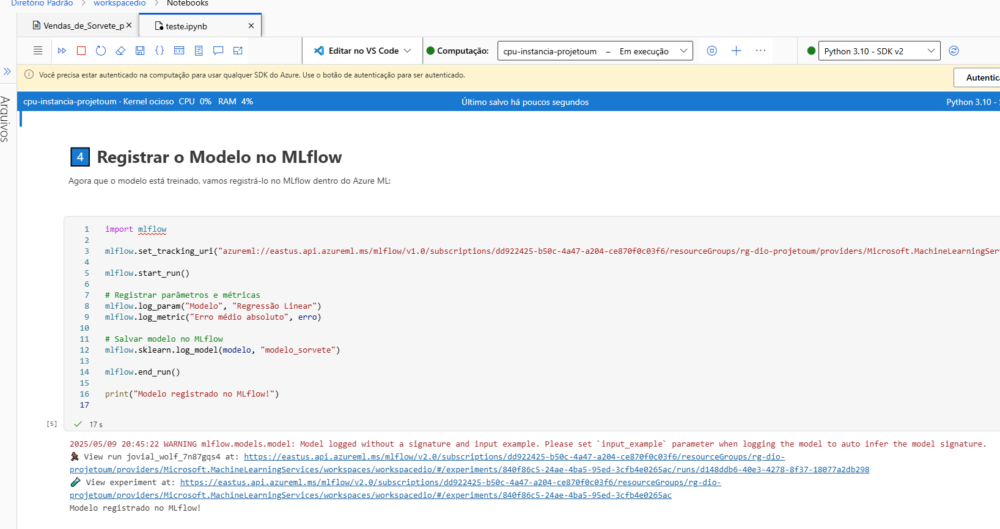

# 🍦 Previsão de Vendas de Sorvete com Machine Learning

Este projeto tem como objetivo prever a quantidade de sorvetes vendidos com base na temperatura do dia, ajudando a sorveteria fictícia "Gelato Mágico" a planejar melhor sua produção.

## 📁 Estrutura do Projeto
- `inputs/`: contém o arquivo CSV com os dados de temperatura e vendas
- `notebooks/`: código em Python para análise, modelagem e registro no MLflow
- `imagens/`: prints da execução no Azure Machine Learning
- `requirements.txt`: bibliotecas utilizadas
- `README.md`: este arquivo :)

## 🔧 Ferramentas Utilizadas
- Python
- Pandas
- Scikit-learn
- Matplotlib
- MLflow
- Azure Machine Learning Studio

## 🧠 Etapas Realizadas
1. **Carregamento e exploração dos dados**
2. **Visualização da relação entre temperatura e vendas**
3. **Treinamento do modelo de regressão linear**
4. **Avaliação com erro médio absoluto: `12.47`**
5. **Registro do modelo com MLflow**

## 📸 Prints do Projeto
> Aqui você pode adicionar imagens como:

- Gráfico de dispersão:
  

- Registro do modelo:
  

## 💬 Aprendizados
- Machine Learning pode ser aplicado de forma simples em problemas do dia a dia
- O Azure ML facilita todo o fluxo de experimentação
- O MLflow ajuda a manter versões e rastrear métricas

## 🚀 Possibilidades Futuras
- Integrar com API de clima em tempo real
- Criar uma interface web com Streamlit
- Usar algoritmos mais complexos para melhorar a previsão
